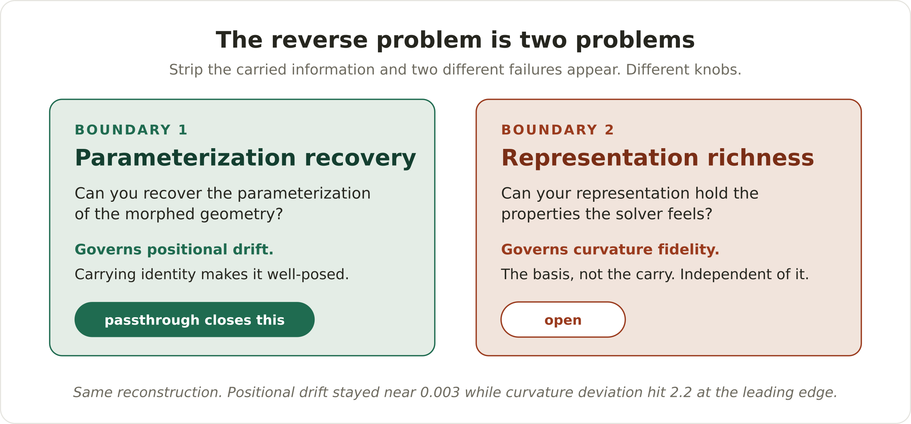
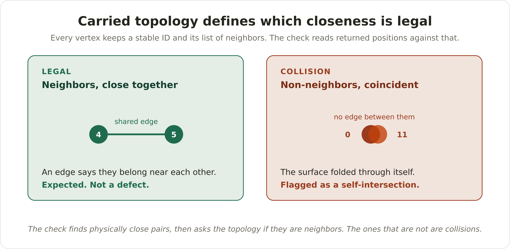

# passthrough

**Easy to mesh something and get it back. Hard to turn that mesh into another thing that is close in the right ways and deforms in the right ways.**

That gap is the reverse problem in computational geometry: forward (CAD to mesh) is solved, but reverse (a morphed mesh back to an analytic CAD surface that behaves like the part) is not. passthrough is a small, validated instrument for studying that crossing. It carries identity and topology across the boundary so a reconstruction is constrained, its validity is checkable, and its deviation is measurable.

It is also an experiment, and the experiment found something: the reverse problem is not one problem.

## The result: two boundaries, not one



Strip the carried information away rung by rung and two distinct failures appear, governed by different things:

- **Boundary 1, parameterization recovery.** Can you recover the parameterization of the morphed geometry? This governs positional drift. Carrying identity makes it well-posed. Where you cannot carry it, a raw scan or a changed topology, it stays hard. passthrough closes this one.
- **Boundary 2, representation richness.** Can your representation hold the properties the solver is sensitive to, like curvature continuity? This is a function of the basis, the knots, and the degrees of freedom, not of the carry. Carrying identity does nothing for it. This one stays open.

On the synthetic wing, the same reconstruction holds positional drift near `0.003` while curvature deviation reaches `2.2` at the leading edge. Position is calm, curvature is not, and the two numbers are the two boundaries.


## What this is, and what it is not

This is a single-surface round-trip instrument built on synthetic ground truth, for studying where reconstruction is tractable. It is not a general solver for the reverse problem, and it does not claim to be. The hard cases, an unparameterized point cloud or a changed topology, are exactly where it shows reconstruction degrading, on purpose. The contribution is a clean, measured map of the boundary, not a claim to have removed it.

## How it works

A tagged mesh goes out, an external solver morphs it, and it comes back still carrying its identity. Three layers ride on the same points: position, which the solver may change, and identity and topology, which it may not.

- **Identity** is a stable label per vertex. Vertex 47 is vertex 47 wherever it moves, so correspondence is never inferred.
- **Topology** is the relationship layer: for each vertex, the neighbors it shares an edge with, and the winding order of each face.

A solver is allowed to move positions and is forbidden from renumbering or rewiring. That single contract is what makes reconstruction, validity, and measurement possible. The validity gate reads the returned geometry against the carried identity and produces three distinct signals: identity-not-preserved (the labels stopped matching, a remesh), collision (the labels match but non-neighbors coincide, a self-intersection), and fold (a face orientation inverted).



Collision detection falls out of the carried adjacency: neighbors near each other is expected, non-neighbors coincident is a self-intersection. The topology is the reference that tells a feature from a defect.

## Run it

Requires Python 3.13 and [uv](https://docs.astral.sh/uv/). Rhino is optional and only needed for the Grasshopper side.

```bash
uv sync
uv run python -m pytest          # 123 passing

# emit a clean payload (the synthetic wing), then run one round trip
uv run python scripts/run_roundtrip.py emit exchange/payload.json --kind good
uv run python scripts/run_roundtrip.py run exchange/payload.json exchange/return --morph clean
```

A clean pass writes `result.json` (the reconstructed analytic surface, schema `passthrough.surface.v1`), `field.json` (the per-vertex deviation field), and `status.json`. Swap `--morph clean` for `collision` or `fold` to see the validity gate catch an unphysical return instead.

## The experiment

The two-boundary result comes from a degraded-information ladder: hold the same wing and the same loop, and remove what you carry across the boundary, rung by rung.

| Rung | What you carry | Positional drift (max) | Status |
|------|----------------|------------------------|--------|
| 1 | UV + identity + topology | `1.9e-3` | reconstructed |
| 2 | identity + topology, UV estimated | `1.9e-2` | reconstructed, ~10x worse |
| 3 | unordered point cloud | `2.58` | ill-posed |
| 4 | remesh, connectivity changed | blocked | blocked by the gate |

```bash
uv run python scripts/run_phase6.py    # writes the table and a drift-vs-rung plot
```

Positional drift climbs three orders of magnitude as the carry is removed. That climb is what carrying identity is worth. Curvature deviation, notably, does not climb with it: it is already saturated by the basis at rung 1, which is the evidence that the two boundaries are independent.

## The Grasshopper plugin

`plugin/` holds a C# Grasshopper plugin (Rhino 8) that reads the exchange files and rebuilds the reconstructed `passthrough.surface.v1` surface natively on the canvas, alongside the deviation field and the drift and curvature numbers. The geometry math stays in tested Python; the plugin is a construction and display client that consumes the same file contract.

## What is not solved

Stated plainly, because it is the honest edge of the work:

- **The per-region deviation report.** The handoff a CAD team actually needs is "changed only where the simulation changed it," which means partitioning deviation into the regions that should have moved and the regions that should not, and checking each. The data exists in the field file; the partition and check are not built yet.
- **Boundary 2 in general.** Representation richness is named and measured here, not addressed. Adaptive knot insertion driven by carried curvature, the NURBS analog of adaptive mesh refinement, is the direction, not a result.
- **The learned reconstruction.** A differentiable reconstruction would give gradient transfer from mesh point back to parameter natively. It is documented as the structured path and left unbuilt.

## Layout

```
src/passthrough/   the instrument: geometry, exchange, reconstruct, validity, driftgauge, report
scripts/           phase runners and the round-trip runner
specs/             the spec behind each phase
plugin/            the C# Grasshopper plugin
docs/              figures and phase notes
tests/             123 tests on synthetic ground truth
```

## License

See `LICENSE`.
